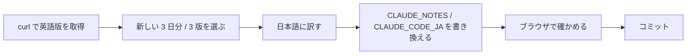

# リリースノートの埋め込み

リリースノートは CORS ヘッダーを返さないので、ブラウザでは取得しない。
この手順で `index.html` の `CLAUDE_NOTES` を書き換え、コミットと push で
反映する（TODO-017）。

Claude Code の CHANGELOG は英語版をブラウザで取得するが、日本語版は無いので、
同じ手順で訳して `CLAUDE_CODE_JA` に埋め込む（TODO-020）。下の 1〜4 を
リリースノートと CHANGELOG の両方で行い、5 と 6 は 1 回にまとめる。
2 の「何も変えずに終える」はその片方を飛ばす意味で、両方とも変わらないときだけ
手順全体を終える。

訳と埋め込みだけの定期のデータ更新なので、TODO 項目は立てず、確認の
担当も分けない。下の「確かめる」を main が行ってコミットする。



## 1. 取得する

```bash
curl -sL --max-time 30 https://platform.claude.com/docs/en/release-notes/overview.md
```

日本語版（`/docs/ja/`）は英語版より遅れるので使わない。

CHANGELOG:

```bash
curl -sL --max-time 30 https://raw.githubusercontent.com/anthropics/claude-code/main/CHANGELOG.md
```

## 2. 新しい 3 日分を選ぶ

- `### October 7, 2026` のような見出しが 1 つの更新。**同じ日付の見出しが
  続くことがある**ので、日付ごとにまとめ、新しい日付から 3 つ取る
- 各見出しの下の `* ` か `- ` で始まる箇条書きを、その日の項目にする
- 今の `CLAUDE_NOTES` と同じ 3 日分で、中身も変わっていなければ、
  何も変えずに終える

CHANGELOG:

- `## 2.1.293` のような見出しが 1 版。新しい版から 3 つ取る
- 各版の箇条書きは**先頭から 8 項目まで**にする（英語版の取得と同じ）
- 今の `CLAUDE_CODE_JA` と同じ 3 版で、中身も変わっていなければ、何も変えずに終える

## 3. 訳す

- 1 日分を 1 つのオブジェクトにする

  ```js
  {
    "title": "2026年10月7日の更新",
    "author": "Claude Platform リリースノート",
    "text": "1 つ目の項目。\n2 つ目の項目。"
  }
  ```

- CHANGELOG は 1 版を 1 つのオブジェクトにし、`title` を
  `"Claude Code 2.1.293（日本語）"`、`author` を `"Claude Code CHANGELOG"` にする。
  履歴は `title` を保存するので、英語版と見分けられるよう「（日本語）」を付ける
- `text` は項目ごとに `\n` で区切る。項目の中では改行しない
- Markdown の記法は残さない。リンクは表示の文字だけにし、`**` や
  バッククォートは外す（`claude-haiku-5-5` のような識別子そのものは残す）
- 自然な日本語の「です・ます」調にする。モデル名、API・パラメーター名、
  エラーコード、製品名（Claude Managed Agents など）は訳さない
- 価格の `$0.10 USD` のような書き方は原文のまま残す
- 練習文として打つので、`<` `>` `{` `}` のような打ちにくい記号は、
  原文にあるときだけ残す（足さない）

## 4. 書き換える

- `index.html` の `const CLAUDE_NOTES = [` から対応する `];` までを
  置き換える。CHANGELOG は `const CLAUDE_CODE_JA = [` から対応する `];` まで
- その上のコメント `（YYYY-MM-DD 時点の内容…）` を、取得した日に直す
- ほかの箇所は変えない

## 5. 確かめる

`python3 -m http.server 8080` で配信し、`node` から Playwright で
`http://localhost:8080/` を開く。

- コンソールにエラーが無い
- 練習文の選択欄に「・YYYY年M月D日の更新」が 3 つ並ぶ
- 選択欄の「・Claude Code 2.1.xxx（英語）」の後に「・Claude Code 2.1.xxx（日本語）」が
  3 つ並び、選ぶと訳が出る
- 「Claudeニュースまとめ」を選ぶと、3 日分が `【タイトル】本文` の形で出る
  （CHANGELOG は含まない）

## 6. コミットする

```
chore(news): リリースノートと CHANGELOG の訳を YYYY-MM-DD 時点に更新する
```

片方だけ更新したときは「リリースノートを…」「CHANGELOG の訳を…」とする。

push は利用者が行う。
