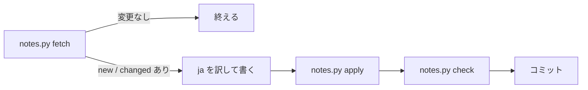

# リリースノートの埋め込み

リリースノートは CORS ヘッダーを返さないので、ブラウザでは取得しない。
この手順で `index.html` の `CLAUDE_NOTES` を書き換え、コミットと push で
反映する（TODO-017）。

Claude Code の CHANGELOG は英語版をブラウザで取得するが、日本語版は無いので、
同じ手順で訳して `CLAUDE_CODE_JA` に埋め込む（TODO-020）。

訳と埋め込みだけの定期のデータ更新なので、TODO 項目は立てず、確認の
担当も分けない。下の「確かめる」を main が行ってコミットする。

訳すところだけ Claude が行い、ほかは `notes.py` が行う（TODO-031）。
作業用の JSON はスクラッチパッドに置く。手元では `~/bin/update-release-notes` に `notes.py` へのシンボリックリンクを張ってあり、どこからでも呼べる（リポジトリには含まない）。



## 1. 取得する

```bash
.claude/skills/update-release-notes/notes.py fetch <作業用.json>
```

- リリースノートは英語版（`/docs/en/`）を取る。日本語版は英語版より遅れるので使わない
- リリースノートは同じ日付の見出しをまとめて新しい 3 日分、CHANGELOG は新しい 3 版の
  先頭 8 項目まで（英語版の取得と同じ）を、それぞれ `en` に入れる
- 前回の英語（`last-source.json`）と比べて、日・版ごとに `same` / `changed` / `new` を出す
- 最後の行が「変更なし」なら、何も変えずに終える（片方だけ変わったときは、その片方だけ訳す）
- 3 日分・3 版を読めない、項目が 0 件のものがある、というときはエラーで止まる。元の書式が変わっていないか見る

## 2. 訳す

`changed` と `new` のものだけ、`ja` に訳を書く。`en` の 1 項目を `ja` の 1 要素にし、
数と並びを揃える。`same` のものは今の訳をそのまま使うので書かない。

- `title` は `notes.py` が付ける。CHANGELOG の「（日本語）」は、履歴が `title` を
  保存するので英語版と見分けるためのもの
- 項目の中では改行しない
- Markdown の記法は残さない。リンクは表示の文字だけにし、`**` や
  バッククォートは外す（`claude-haiku-5-5` のような識別子そのものは残す）
- 自然な日本語の「です・ます」調にする。モデル名、API・パラメーター名、
  エラーコード、製品名（Claude Managed Agents など）は訳さない
- 価格の `$0.10 USD` のような書き方は原文のまま残す
- 練習文として打つので、`<` `>` `{` `}` のような打ちにくい記号は、
  原文にあるときだけ残す（足さない）

## 3. 書き換える

```bash
.claude/skills/update-release-notes/notes.py apply <作業用.json>
```

`CLAUDE_NOTES` / `CLAUDE_CODE_JA` と、変わった側の上のコメントの日付を書き換え、
`last-source.json` を今回の英語にする。`ja` の数が `en` と合わないと、何も書かずに止まる。

## 4. 確かめる

```bash
.claude/skills/update-release-notes/notes.py check
```

空いているポートで配信し、`node` から Playwright で次を確かめる。`OK` と出れば済み。

- コンソールにエラーが無い
- 練習文の選択欄に「・YYYY年M月D日の更新」が 3 つ並ぶ
- 選択欄の「・Claude Code 2.1.xxx（英語）」の後に「・Claude Code 2.1.xxx（日本語）」が
  3 つ並び、選ぶと訳が出る
- 「Claudeニュースまとめ」を選ぶと、3 日分が `【タイトル】本文` の形で出る
  （CHANGELOG は含まない）

## 5. コミットする

```
chore(news): リリースノートと CHANGELOG の訳を YYYY-MM-DD 時点に更新する
```

`last-source.json` も一緒にコミットする。片方だけ更新したときは「リリースノートを…」「CHANGELOG の訳を…」とする。

push は利用者が行う。
