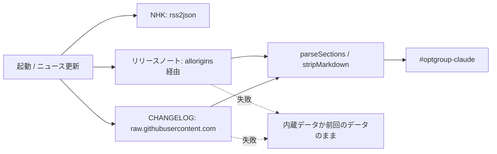

# TODO-005. 「ニュース更新」で Claude Platform のリリースノートも取得する

|      | main | 担当 |
|------|------|------|
| 見込み | Opus 5.5 / effort medium | main（実装）+ reviewer（Opus / high）+ verifier（Sonnet / medium） |
| 実施 | Opus 5.5 / effort medium | main（実装）+ reviewer（Opus 5.5 / high、4 回）+ verifier（Sonnet 5.5 / medium、3 回） |

| 担当 | モデル | effort | input | output | cache_creation | cache_read | 割合 |
|------|--------|--------|-------|--------|----------------|------------|------|
| main | Opus 5.5 | medium | 162 | 59,331 | 113,126 | 8,248,509 | 60% |
| reviewer | Opus 5.5 | high | 120 | 4,170 | 132,595 | 4,614,579 | 34% |
| verifier | Sonnet 5.5 | medium | 48 | 262 | 113,178 | 783,686 | 6% |
| 合計 |  |  | 330 | 63,763 | 358,899 | 13,646,774 | 計 14,069,766 |

- reviewer・verifier とも、モデルは定義のまま（上書きなし）。effort は Agent ツールで定義と同じ値（high / medium）を渡した
- 立ててから着手まで TODO-004 を挟んだので、Claude Code の CHANGELOG を足したコミット（80de2d1）の時刻から `--since` で数えた
- verifier はサブエージェントのログが欠けやすく、実際より少なく出ている可能性がある

## きっかけ

利用者の依頼（2026-10-07）。Claude 公式で日本語の取得元は Claude Platform のリリースノートだけで、
Anthropic のニュース（英語のみ・RSS 無し）は入れないと利用者が決めた。立てたあとで、Claude Code の
CHANGELOG（日本語版は無い）も英語のまま入れることになった。

着手後に、次の指示が順に足された。

- 英単語の間の空白は半角スペース 1 個にする
- 全角の括弧・引用符・記号を半角にそろえる（いったん実装した）
- 〜 と日本語の ー は、日本語では全角のまま
- 最後に方式を変え、お手本は全角・半角を変えず、照合で「形が同じなら全角でも半角でも正解」にする。
  TODO-003 の「全角の英数字は半角にし、全角で打ったらミス」を覆す。お手本の長音 ー に `-` を打っても
  正解になること、全角の英数字の間の空白が半角スペースで残ることも、利用者が了承した

## やったこと

`index.html` と `README.md` を変えた。

- **CORS プロキシ:** 候補 5 つを実測した。auto mode に拒否されたので、利用者が `!` で実行した。
  allorigins だけがヘッダー（200、`access-control-allow-origin`）を返し、本文の途中で接続を切られた。
  corsproxy.io は 401、cors.eu.org は 429、codetabs は時間切れ、thingproxy は名前解決できなかった。
  allorigins を使い、15 秒で打ち切る（`AbortSignal.timeout`）
- **取得と解析:** リリースノートは `### ` の見出しで新しい 3 日分を、CHANGELOG は `## ` の最初の版の
  先頭 8 項目を取る。箇条書きの行だけを拾い、リンク・`` ` ``・`*`・エスケープの `\`・`&lt;` などを外す
- **選択欄:** 先頭に「🤖 Claudeニュース」（まとめ、日付ごと、`Claude Code <版>（英語）`）を置き、
  起動時の既定を Claude ニュースのまとめにした
- **失敗時:** 取れなかった方は内蔵データ（`FALLBACK_CLAUDE_NOTES` / `FALLBACK_CLAUDE_CODE`、2026-10-07 時点）か
  前回取得したデータのまま。NHK も同じ扱いに変えた（以前は失敗のたびに `FALLBACK_NHK_NEWS` を当て直していた）。
  「ニュース更新」は両方を取り直して Claude まとめを選び、失敗があれば alert を 1 回出す
- **起動時の差し替え:** `isUntouchedSummary()` で、打ち始める前でそのまとめを開いたままのときだけ差し替える
  （`isNewsSummary` を `isSummary` に改名し、両方のまとめで使う）
- **空白:** 日本語・改行・行頭行末の隣の空白は詰め、それ以外（英単語の間）は半角スペース 1 個にする
- **表示:** `.char` に `white-space: pre` を足して空白の幅を出し、英単語を `.word`（inline-block、nowrap）に
  まとめて単語の途中で折り返さないようにした。単語の後ろの空白は単語に含める。20 字を超える単語は
  画面に収まらないことがあるのでまとめない
- **照合:** `toSameShape()` で、全角の英数字・記号（U+FF01〜FF5E）、“”‘’、ハイフン類と ー、〜、全角空白を
  1 つにそろえてから比べる。お手本（`cleanText`）は全角・半角を変えない

## 確かめたこと

- reviewer（4 回）: 要修正は 0 件。検討の指摘から、選択の戻しの条件、エスケープの外し方、空白の条件、
  長い単語の折り返し、照合の分岐を直した。報告は [archives/agents/TODO-005/reviewer-report.md](../agents/TODO-005/reviewer-report.md)
- verifier（3 回、Playwright、外部は `page.route` で差し替え）: 外部を全部止めたとき・全部成功したとき・
  打ち始めたあとの取得・allorigins だけ失敗したときの選択欄と本文、alert の回数、空白、
  1280px と 375px の表示、全角で打ったときの照合が期待どおり。pageerror は 0。報告は
  [archives/agents/TODO-005/verifier-report.md](../agents/TODO-005/verifier-report.md)、スクリプトは `verify.mjs`
- 実際の allorigins からの取得はブラウザで確かめていない（auto mode の判定で外部へ出られないため）

## 残ること

- お手本の改行が画面で改行にならない（変更前からある）。TODO-006 にした
- allorigins は実測で本文の途中で切られていた。取得できないことが多ければ、別の取得元を考える

## 分担の振り返り

- **reviewer:** 空白の span が幅 0 になりうること（検討 1）を最初に見つけ、verifier の実測につながった。
  選択の戻しの食い違い、`ー` と `-` の照合、〜 の扱いの境目など、利用者の判断が要る点を毎回洗い出した
- **verifier:** 空白の幅 2px・単語の途中の折り返し 10 か所・行頭の空白を数値とスクリーンショットで示した。
  スクリーンショットから、改行が効いていない元からの不具合（TODO-006）が見つかった
- **見込みとの食い違い:** 担当の組み方は見込みどおり。回数が reviewer 4 回・verifier 3 回に増えたのは、
  着手後に全角・半角の方針が 3 回変わったため。reviewer の cache_read が main の半分を超えたのは、
  同じ担当に続けて頼み、会話が伸びたまま読み直したため
- **次に同じ規模なら:** 文字の扱い（空白・全角・半角）のように方針が揺れそうな点は、実装前に例を並べて
  利用者に決めてもらい、決まってから reviewer を起こす。レビューの往復が 4 回から 1〜2 回に減り、
  reviewer の分（全体の 34%）を大きく減らせた
