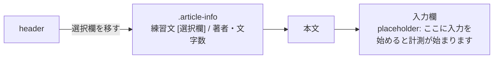

# TODO-009. 練習文の選択欄をタイトルの位置へ移し、計測の始まりを入力欄に書く

|      | main | 担当 |
|------|------|------|
| 見込み | Opus 5.5 / effort medium | main（実装）+ reviewer（Opus 5.5 / high）+ verifier（Sonnet 5.5 / medium） |
| 実施 | Opus 5.5 / effort medium | main（実装）+ reviewer（Opus 5.5 / high）+ verifier（Sonnet 5.5 / medium） |

| 担当 | モデル | effort | input | output | cache_creation | cache_read | 割合 |
|------|--------|--------|-------|--------|----------------|------------|------|
| main | Opus 5.5 | medium | 88 | 20,672 | 43,953 | 3,579,714 | 72% |
| reviewer | Opus 5.5 | high | 46 | 2,994 | 62,329 | 903,020 | 19% |
| verifier | Sonnet 5.5 | medium | 34 | 1,753 | 71,910 | 405,933 | 9% |
| 合計 |  |  | 168 | 25,419 | 178,192 | 4,888,667 | 計 5,092,446 |

- 立ててから着手まで空いたので、`--since '2026-10-07 20:13:09'` で集計した
- 見込みの行は、項目を広げたときに書き直したもの（当初は main（実装）+ verifier（Sonnet 5.5 / medium））

## きっかけ

いつ計測が始まるかが画面に書かれておらず、練習文の選択欄にも項目名が無かった。
着手前後に利用者から指示が続き、項目を広げた。

- 当初はタイトルの上に「入力を始めると計測が始まります」を置く案だったが、入力欄の placeholder に書く形に変えた
- 項目名は「お手本」に違和感があるとのことで「練習文」にし、文書もこれに揃えた
- タイトルの位置に選択欄を置き、別のタイトル表示はやめた
- 「フォーカス維持: 常に有効」とフッタは要らないので消した

## やったこと

`index.html` と `README.md` を変えた。

- 入力欄の placeholder を「ここに入力を始めると計測が始まります」にした。640px 以下では `::placeholder` を 0.85rem にして欠けないようにした
- header の `#preset-select` を main の `.article-info` に移し、`#article-title` を消した。左に `<label for="preset-select">練習文</label>` を置き、`.preset-group` で 1 行にまとめた。選択欄は `max-width: 100%` で本文の幅に収まる
- カスタム文章を適用したら、「カスタム」の中の `#opt-custom-text` に「✏️ 題名」を出して選んだ状態にする。選び直すとその文章に戻る
- 「フォーカス維持: 常に有効」と、そこでしか使わない `.kbd` の CSS、`footer` とその CSS を消した
- `README.md`、プリセット「日本語長文タイピングの特徴」の本文、コードのコメントの「お手本」を「練習文」にした（`archives/` は変えていない）

## 確かめたこと

verifier が Playwright（1280x800 と 375x812）で測った。報告は [archives/agents/TODO-009/](../agents/TODO-009/README.md)。

- 選択欄とラベルが同じ行にあり、ページの横スクロールが無い（375 幅で選択欄の右端は 351）
- 375 幅で placeholder の幅は 244.7px、入力欄の内側は 253.8px で、全文が見える
- 80 字の題名のカスタム文章でも選択欄がはみ出さない。別の練習文へ移ってから選び直すと戻る
- 1 文字入れると計測が始まる。pageerror は 0 件

reviewer は、カスタムの画面を開いて閉じる、2 回適用する、「次の文章」から選び直す、の場面を Playwright で試し、おかしな状態は無かった。

## 残ること

- 375 幅の placeholder の余りは 9.1px しかない。文言を長くすると欠ける

## 分担の振り返り

- **reviewer**: フッタのコメントの消し忘れ、カスタム文章で選択欄に前の練習文名が残る件、長い題名と狭い画面ではみ出す件を見つけた。後の 2 つは前からあった動きだが、タイトルを消したことで目立つようになった
- **verifier**: 1 回目は旧仕様（タイトル上の案内文）を確かめたが、その後に仕様が変わって無駄になった。2 回目は 375 幅で placeholder の欠けとラベルの縦割れを見つけた。placeholder の欠けは scrollWidth に出ないので、canvas で測らせた
- **見込みとの食い違い**: 担当の組み方は見込みどおり。ただ、確認中に利用者の指示が 4 回届き、verifier の 1 回目が丸ごと無駄になった
- **次に同じ規模なら**: 画面の文言や配置を変える項目は、利用者の指示が固まってから verifier を起こす。reviewer を先に回し、指摘を直してから verifier に渡す順は今回どおりにする
