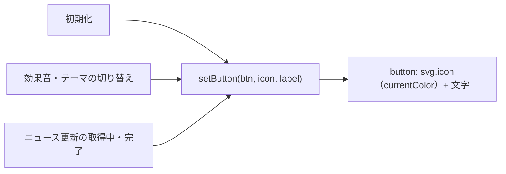

# TODO-011. ヘッダーのボタンの絵文字をモノクロのアイコンにする

|      | main | 担当 |
|------|------|------|
| 見込み | Opus 5.5 / effort medium | main（実装）+ reviewer（Opus 5.5 / high）+ verifier（Sonnet 5.5 / medium） |
| 実施 | Opus 5.5 / effort medium | main（実装）+ reviewer（Opus 5.5 / high）+ verifier（Sonnet 5.5 / medium） |

| 担当 | モデル | effort | input | output | cache_creation | cache_read | 割合 |
|------|--------|--------|-------|--------|----------------|------------|------|
| main | Opus 5.5 | medium | 26 | 6,311 | 12,549 | 1,563,401 | 74% |
| reviewer | Opus 5.5 | high | 24 | 2,272 | 36,860 | 325,423 | 17% |
| verifier | Sonnet 5.5 | medium | 16 | 247 | 26,919 | 167,001 | 9% |
| 合計 |  |  | 66 | 8,830 | 76,328 | 2,055,825 | 計 2,141,049 |

- verifier の output が 247 と小さいのは、`subagents/` のログに最終行が残らない分を拾えていないためと思われる（todo-workflow skill の注意）

## きっかけ

ヘッダーのボタンの絵文字は色付きで、画面の配色と合わない。モノクロのアイコンにしたい、と利用者から。

## やったこと

`index.html` だけを変えた。外部ライブラリは足さず、SVG を `index.html` に書いた。

- `ICONS`（news・reset・soundOn・soundOff・moon・sun の path）と `setButton(btn, icon, label)` を足した。SVG は `stroke="currentColor"` で文字色に合わせ、label は `append` で文字として足す
- ニュース更新・リセット・効果音・テーマのボタンの中身を HTML から消し、初期化で `setButton` を呼ぶ。効果音・テーマの切り替えと、ニュース更新の「取得中...」も `setButton` にした
- 制限時間の選択欄の ⏱️ を消した（option に SVG は入れられない）
- `.icon` の CSS（1.15em 角）を足した

## 確かめたこと

verifier が Playwright（1280x800）で測った。報告は [archives/agents/TODO-011/](../agents/TODO-011/README.md)。

- 4 つのボタンに `svg.icon` が 1 つずつあり、文字は「ニュース更新」「リセット」「効果音: ON」、テーマは文字なし
- 効果音は押すたびに OFF/ON とアイコンが替わる。テーマは月から太陽に替わる
- アイコンの色はボタンの文字色と同じ（ダーク rgb(226, 232, 240)、ライト rgb(15, 23, 42)）
- 選択欄に ⏱️ が無い。「ニュース更新」は押すと「取得中...」になり、終わると戻る。pageerror は 0 件

## 分担の振り返り

- **reviewer**: `ICONS` を差し込んだ位置のせいで `isWordSide` のコメントが離れた件と、テーマのボタンの `aria-label` が `title` と同じで意味が無い件を見つけた。どちらも直した（コメントを戻し、`aria-label` を外した）。直した分は 2 行なので reviewer に見直させず、verifier の確認に含めた
- **verifier**: 食い違いは見つけなかった
- **見込みとの食い違い**: 無い
- **次に同じ規模なら**: 同じ組み方でよい。ただ置き換えだけで分岐の意味が変わらない項目なら、reviewer は「置き換え漏れと差し込み位置」に絞って依頼し、Playwright での確認は verifier に任せる（今回は reviewer も Playwright を動かしており、確認が重なった）
