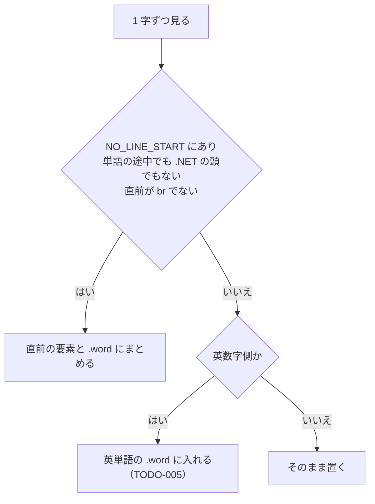

# TODO-015. お手本で行の頭に句読点が来ないようにする

|      | main | 担当 |
|------|------|------|
| 見込み | Opus 5.5 / effort medium | main（実装）+ reviewer（Opus 5.5 / high）+ verifier（Sonnet 5.5 / medium） |
| 実施 | Opus 5.5 / effort medium | main（実装）+ reviewer（Opus 5.5 / high）+ verifier（Sonnet 5.5 / medium） |

| 担当 | モデル | effort | input | output | cache_creation | cache_read | 割合 |
|------|--------|--------|-------|--------|----------------|------------|------|
| main | Opus 5.5 | medium | 34 | 7,132 | 42,055 | 833,971 | 65% |
| reviewer | Opus 5.5 | high | 16 | 119 | 41,653 | 198,464 | 18% |
| verifier | Sonnet 5.5 | medium | 18 | 1,356 | 31,668 | 199,763 | 17% |
| 合計 |  |  | 68 | 8,607 | 115,376 | 1,232,198 | 計 1,356,249 |

- reviewer・verifier とも定義のとおり（reviewer は Agent ツールでも opus / high を指定したが、定義と同じ値）
- 立ててから着手まで TODO-016 を挟んだので、`--since` で TODO-016 のコミット時刻から数えた
- サブエージェントの分は少なめに出る（`token-usage.py` の制約）

## きっかけ

お手本は 1 字ずつ `inline-block` の span なので、ブラウザの禁則処理が効かない。
TODO-014 で英字の文字間隔を詰めたあと、1280px の既定の文章で「。」が行の頭に来た。

## やったこと

`index.html` のみ。

- 行の頭に置かない文字の集合 `NO_LINE_START` を足した（句読点、閉じかっこ、`…` `々` など。半角の `),.!?:;]}` と半角カナの句読点も含む）
- `renderText()` で、その文字が来たら直前の要素（1 字の span か、英単語の `.word`）と一緒に `.word`（`white-space: nowrap` の inline-block）へまとめる
- 半角の記号は、英単語の途中・20 字を超える単語の中・すぐ後ろに英字が続くとき（`.NET`）は、今までどおり単語の側として扱う
- 改行（` `）の直後は、まとめずにそのまま置く

## 確かめたこと

- reviewer: renderText を抜き出して node で 24 例を試し、`charElements` の順と `data-index` が崩れないことを確かめた。指摘のうち、`.NET` が分かれる件・`〛` などの抜け・CSS のコメントの件・`letterSpacing` の重複は直した
- verifier: Playwright で 1280・800・375px × 既定の文章・走れメロス（と 375px の吾輩は猫である）を測り、行頭に `NO_LINE_START` の文字が来た行は 0。変更前の版では全条件で 1〜4 件出たので、計測は失敗を拾える。打鍵（`insertText` で 5 字）と改行の位置も変わらず動く

## 残ること

- 20 字を超える単語の中の半角記号は、行の頭に来ることがある（TODO-005 で長い単語はどこで折り返してもよいとした扱いのまま）
- 行の頭に置かない文字が続くと、上限なく 1 つの塊になる（`…` を何十字も並べた文章は想定しない）
- 開きかっこが行の末に来るのを防ぐ処理（行末禁則）は入れていない

## 分担の振り返り

- reviewer は `.NET` の分かれ（変更で生じた退行）と文字の抜けを見つけた。verifier は変更前の版と比べて、計測が失敗を拾えることまで示した。どちらも食い違いは見つけなかった
- 見込みどおりの編成で、食い違いは無い
- 次に同じ規模（1 関数の分岐の追加）なら同じ組み方でよい。reviewer に node で分岐を切り出させたのは効いたので、verifier はブラウザでの実測だけに絞る形を続ける
