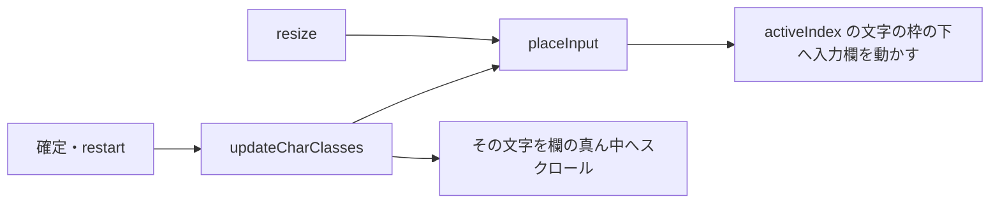

# TODO-025. 入力欄をお手本の今の行の真下に出す

|      | main | 担当 |
|------|------|------|
| 見込み | Opus 5.5 / effort medium | main（実装）+ reviewer（Opus 5.5 / high）+ verifier（Haiku 5.5 / medium） |
| 実施 | Opus 5.5 / effort medium | main（実装）+ reviewer（Opus 5.5 / high、2 回）+ verifier（Haiku 5.5 / medium、3 回） |

| 担当 | モデル | effort | input | output | cache_creation | cache_read | 割合 |
|------|--------|--------|-------|--------|----------------|------------|------|
| main | Opus 5.5 | medium | 78 | 20,171 | 44,936 | 3,227,137 | 59% |
| verifier | Haiku 5.5 | medium | 52 | 18,321 | 153,418 | 1,343,646 | 27% |
| reviewer | Opus 5.5 | high | 36 | 3,232 | 63,637 | 727,220 | 14% |
| 合計 |  |  | 166 | 41,724 | 261,991 | 5,298,003 | 計 5,601,884 |

- reviewer・verifier とも、定義のモデルと effort のまま。2 回目以降は同じ担当に続けて頼んだ

## きっかけ

お手本の欄が画面の高さいっぱいまで伸び、今の文字を欄の真ん中に置くので、
下の入力カードとの間が数行あいていた。お手本のすぐ下で入力（変換中の文字を含む）が
見えるようにしたい、と利用者から。「今の行を欄の下端に寄せる」案は、この先の文が
見えなくなるので採らなかった（利用者と決めた）。

## やったこと

`index.html` だけを変えた。

- 入力カード（`.typing-input-card`）をなくし、`#typing-input` を `#text-display` の中へ移して絶対配置にした。`renderText()` は `replaceChildren(fragment, input)` で文字だけ入れ替える
- `placeInput()` を足し、今の文字の枠のすぐ下（3px 下）、今の文字の left に入力欄を置く。行末では右へはみ出さないよう左へ寄せる。`updateCharClasses()` と window の resize から呼ぶ
- `activeIndex()` を足した。行末の改行を打ち終えたら、光る枠（`.active`・`.miss`）も入力欄も次の行の頭に合わせる（利用者が選んだ）
- `.char` の line-height を 1.4 にして枠を字の高さにとどめ、本文の行間を 3（640px 以下は 3.4）に広げた
- 入力欄は 1rem・min-width 15em。狭い画面でも 16px 未満にしない（iOS Safari がフォーカス時に拡大するため）。親の `user-select: none` を受け継がないよう `user-select: text` を付けた

## 確かめたこと

verifier が 1280×800 と 375×700 で実測した（[verifier-report.md](../agents/TODO-025/verifier-report.md)）。

- 入力欄は今の文字の枠と重ならず、枠の下端から 2.5〜4.0px 下に出る。次の行の字との隙間は 1280 幅で約 9px、375 幅で 8.6〜9.3px（行間を 3.4 にする前は 1.9〜2.6px だった）
- 行末の改行を打ち終えた直後、`.active` が次の行の頭に移り、入力欄の left と揃う
- 誤入力で `.miss` が `.active` に付き、`.error` が付いても入力欄の位置は変わらない
- 幅を 1280→800 に変えると置き直される。案内文は欄の中で欠けない

reviewer は、消した `markMiss()` の行が要らないこと、done/active の境が変わっても進捗・結果・履歴の数字が変わらないことを確かめた（[reviewer-report.md](../agents/TODO-025/reviewer-report.md)）。

## 残ること

- 幅 320px 未満の画面では、入力欄（min-width 15em）が右へはみ出すことがある。どこまで面倒を見るかは決めていない
- reviewer が範囲外として挙げた既存の挙動: 読み飛ばした改行が `correctChars` に入るかどうかが、読み飛ばした場所で変わり、CPM と正確率が 1 字ずれる。直すなら別の項目にする

## 分担の振り返り

- **reviewer** は 1 回目に、iOS で拡大されるおそれ、案内文が欠けるおそれ、改行の位置で枠と入力欄が 1 行ずれることを見つけた。2 回目は消した行が要らないことの裏付けと、狭い画面の隙間が 1.6px しかないという計算を出した
- **verifier** は 1 回目に、改行のところで枠と入力欄がずれることを数値で示した。2 回目に、375 幅で次の行との隙間が 2px ほどしかないことを測った。ただ、枠が行の高さいっぱいで入力欄と重なっていることは、verifier ではなく、利用者に頼まれて撮ったスクリーンショットを main が見て気づいた。verifier は「字の部分」（縦の真ん中 ±0.5 字）だけを重なりの判定に使っていて、光る枠の矩形は見ていなかった
- **見込みとの食い違い**は担当の回数だけ（reviewer 2 回、verifier 3 回）。原因は、main が実装したあと最初のスクリーンショットで枠と入力欄の重なりを見落とし、直しが 2 回に割れたこと。最後の行間の直し（`.char` の line-height と `placeInput()` の位置の式）は、reviewer に回さず verifier の実測だけで済ませた
- **次に同じ規模の項目をやるなら:** 位置を合わせる項目では、verifier の依頼に「重なりを見る相手」を矩形の名前で全部書く（今回なら `.char.active` の矩形と、次の行の `.char` の矩形）。main も最初の自分のスクリーンショットで、枠と欄の境目を拡大して見てから reviewer に回す。そうすれば reviewer 1 回・verifier 2 回で足りた
